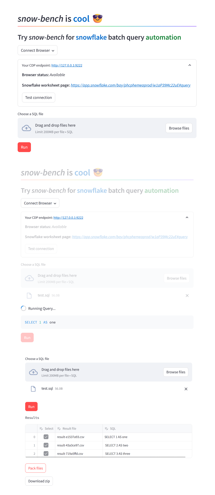

# snow-bench

Try _snow-bench_ for batch querying **Automation** on **Snowflake**.

Preview online: https://snowbench.streamlit.app/



### Deployment Steps

1. **Install Dependencies**
    ```shell
    $ poetry install
    ```

2. **Browser Plugins Installation**
    ```shell
    $ playwright install
    ```

3. **Launch the Application**
    ```shell
    $ streamlit run snow_bench/app.py
    ```
   Start exploring and managing your queries right away with our intuitive Streamlit interface.

### Browser Setup

#### Launch Browser with CDP

- **Windows:**
    ```shell
    chrome.exe --remote-debugging-port=9222
    ```
- **macOS:**
    ```shell
    /Applications/Google\ Chrome.app/Contents/MacOS/Google\ Chrome --remote-debugging-port=9222
    ```

#### Open Snowflake Worksheets

1. **Login to Snowflake Console**

    Access your Snowflake account to begin.

2. **Navigate to Worksheets**

    Head over to the 'Projects' section, then select 'Worksheets'.

3. **Manage Your Queries**

    - Either open an existing worksheet or forge a new one to craft and automate your queries efficiently.
